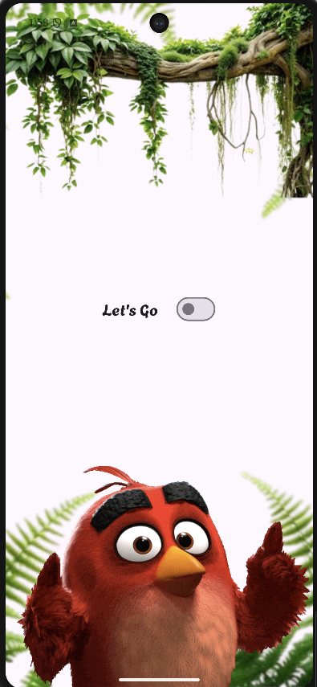
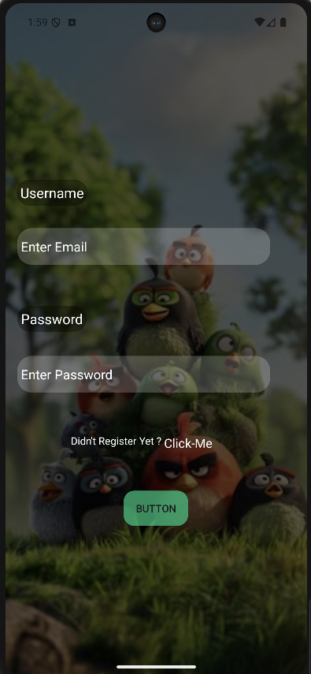
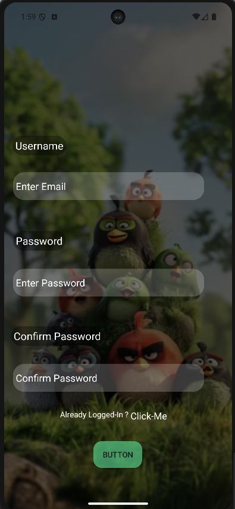
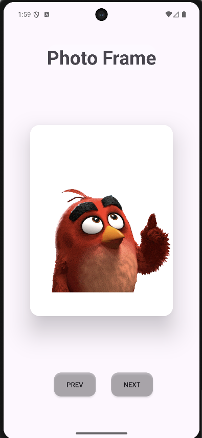
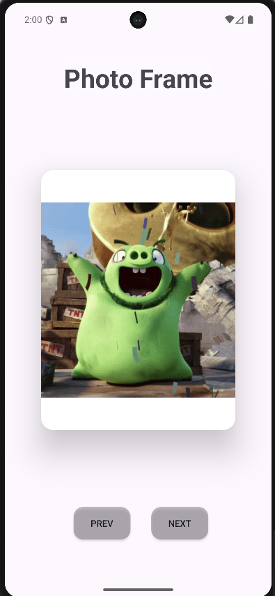
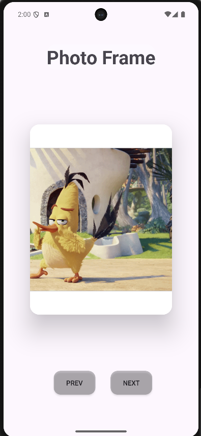

# Photo Frame App 🖼️

A simple Android Photo Frame app built using Kotlin.

The idea was straightforward:
"Just show photos and switch between them."

Android replied:
"Achha? Let's see about that."

---

## 📸 Features

* View photos inside a photo frame
* Previous Button
* Next Button
* Circular navigation
* Clean and simple UI
* Beginner-friendly project

---

## Screenshots

Welcome Screen
<p align="center">
  
</p>
Login Screen
<p align="center">
  
</p>
Register Screen
<p align="center">
  
</p>
Main-Frames
<p align="center">
  
  
  
</p>

---

## 🛠️ Tech Used

* Kotlin
* XML
* Android Studio
* View Binding

---

## ⚙️ How It Works

Photos are stored inside an array:

```kotlin
val images = arrayOf(
    R.drawable.pic1,
    R.drawable.pic2,
    R.drawable.pic3,
    R.drawable.pic4
)
```

When the user clicks:

### Next

```text
Photo 1 → Photo 2 → Photo 3 → Photo 4 → Photo 1
```

### Previous

```text
Photo 1 ← Photo 4 ← Photo 3 ← Photo 2 ← Photo 1
```

No crashes.
No index out of bounds.
Only peace.

---

## 💀 Developer Story

At first I thought:

"Ye toh 15 minute ka project hai."

Then:

* Image alignment got messed up
* ConstraintLayout started doing gymnastics
* One image disappeared for no reason
* Previous button went to the future
* Next button went to another dimension

After enough debugging and emotional damage...

It finally worked.

---

## 📚 What I Learned

* Arrays in Kotlin
* ImageView handling
* Click Listeners
* Basic UI design
* Navigation logic
* Why off-by-one errors exist

---

## 🚀 How to Run

Download Git in your System from your favourite Browser's

Clone the repository:

```bash
git clone https://github.com/your-username/PhotoFrameApp.git
```

Then:

1. Open in Android Studio
2. Sync Gradle
3. Run on Emulator or Device
4. Enjoy pressing Next and Previous repeatedly

---

## ⚡ Status

Still learning Android
Still fixing bugs
Still saying:
"It worked yesterday bro."

---

## 👨‍💻 Author

Tejas Jadhav

If something breaks, it's probably a feature.
